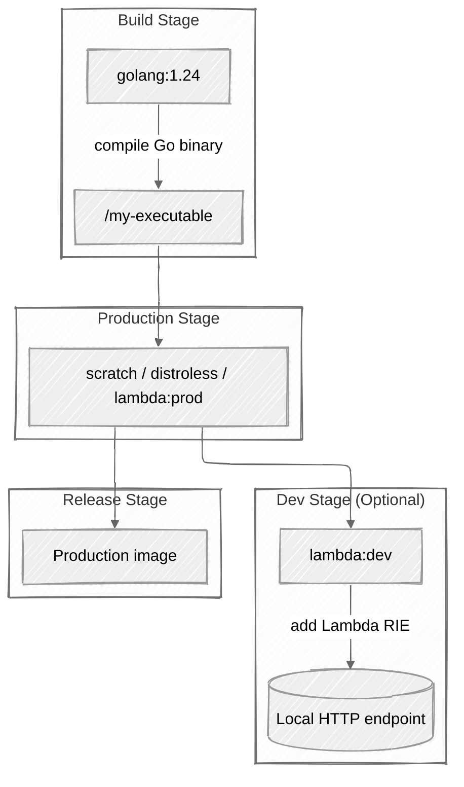

+++
title = 'Multi-stage container images from dev to production'
date = 2025-08-16T15:20:00+02:00
ShowToc = true
tags = ['tech', 'containers', 'go', 'tips', 'short']
+++

[Multi-stage container][docker-multi] images have been a good friend of mine for some time now.
They enable projects to package smarter by splitting the **build** and **run** phases of a given software.

## Intro to multi-stage

Let's start with a simple **hello world** program in Go!

Here is a minimal working example that will be used for our next builds:
```go
package main

import "fmt"

func main() {
	fmt.Println("Hello from Lambda! :)")
}
```

And our initial, easy to use, Dockerfile will look like this:
```Dockerfile
FROM golang:1.24 AS builder

COPY go.mod .

COPY . .

RUN go build -o /my-executable

CMD ["/my-executable"]
```

Building this gives an astonishing **888 MB** image, thanks to all the development and build dependencies baked into [`golang:1.24`][docker-go].
This will be our **baseline**.

Multi-stage containers, as stated in the Docker documentation, allow us to strip away dev/build dependencies from the final image.
This reduces:

* **Image size**
* **Attack surface** (security folks love that)
* **Pull and start-up overhead**

[^1]: This is very easy to notice if you compare the pull time of a 15 GB image to a 15 MB one.

Over time, I’ve even experimented with introducing a **testing stage** in container builds, but I eventually settled into the more common pattern:
use multi-stage to get **lean production images**.

Tools like `uv` now offer fine-grained, cache-enabled build workflows, making this pattern even more attractive.

They have an excellent documentation on that on [Using uv in Docker][uv-docker].

### Simple multi-stage example

Let’s leverage [scratch images][docker-scratch] for the smallest possible image.
Using our initial container image, we will build the go executable, then copy it
into a scratch image which does not include any filesystem.

```Dockerfile
FROM golang:1.24 AS builder

COPY go.mod .

COPY . .

RUN go build -o /my-executable

FROM scratch AS release

COPY --from=builder /my-executable /my-executable

CMD ["/my-executable"]
```

In the above file, the `builder` stage includes every tool required to
create the golang executable, which we then retrieve in the `release`
stage by using the [`COPY --from=<stage>`][docker-copyfrom] directive.

The final resulting image is made of only our executable in an empty base image.
Now the final image is only **2.21 MB**.
Hard to beat without more complex build system configuration.

**However, scratch images may be hard to use in production**: no shell, no package manager, no libraries.

We can work around that using side-car containers if our orchestration engine allows it but if we
want to stick to a independant container image, we can use a more flexible base image.

### Using distroless images

A neat middle ground is provided by [distroless images][gh-distroless]:
they’re slim, minimal images with just the runtime libraries needed to execute your program.

Here’s our Go example adapted to a distroless base:

```Dockerfile
FROM golang:1.24 AS builder

COPY go.mod .

COPY . .

RUN go build -o /my-executable

FROM gcr.io/distroless/static-debian12 AS release

COPY --from=builder /my-executable /my-executable

CMD ["/my-executable"]
```

This gives you:

* Small footprint
* Runtime libraries included
* Slightly better debugging and operational capabilities than `scratch`

`distroless` images can also be **custom-built** using [Bazel rules][gh-bazel-distroless] if you need more control
or want to extend the capabilities included in th end result image.

### Base Image comparison

| Build type                 | Base image                          | Approx. size | Notes                                         |
| -------------------------- | ----------------------------------- | ------------ | --------------------------------------------- |
| **Single-stage**           | `golang:1.24`                       | \~888 MB     | Includes full Go toolchain and build deps     |
| **Two-stage (scratch)**    | `scratch`                           | \~2.2 MB     | Smallest possible image, no OS libs/tools     |
| **Two-stage (distroless)** | `gcr.io/distroless/static-debian12` | \~8–10 MB    | Minimal OS libs included, better prod support |

> Sizes will vary depending on your binary and build flags.
> Scratch is the smallest but lacks runtime tooling, while distroless offers a good security-functionality balance.

## Going further - AWS Lambda support

*I love AWS Lambda. I love Go. Now, I do Lambdas in Go. Quick maths.*

One thing I always want for my Lambdas is **local execution**.
My go-to solution is the **[Lambda Runtime Interface Emulator (RIE)][gh-lambda-rie]** because it’s so
simple to integrate and works with [LocalStack][gh-localstack] for a cloud-like local workflow.

Let's consider the following hello world Lambda code in go:
```go
package main

import (
	"context"
	"encoding/json"
	"fmt"

	"github.com/aws/aws-lambda-go/lambda"
)

type Response struct {
	Message string `json:"message"`
}

func handler(ctx context.Context) (json.RawMessage, error) {
	resp := Response{
		Message: "Hello from Lambda :)",
	}

	data, err := json.Marshal(resp)
	if err != nil {
		return nil, fmt.Errorf("failed to marshal response: %w", err)
	}

	return data, nil
}

func main() {
	lambda.Start(handler)
}
```

And here is a multi-stage `Dockerfile` for a Go-based Lambda:

```Dockerfile
FROM golang:1.24 AS build

WORKDIR /app

COPY go.mod go.sum ./

COPY . .
RUN go build -tags lambda.norpc -o my-lambda

FROM public.ecr.aws/lambda/provided:al2023 AS production

COPY --from=build /app/my-lambda ./my-lambda
ENTRYPOINT [ "./my-lambda" ]

FROM production AS dev

RUN mkdir -p /aws-lambda-rie && \
    curl -Lo /aws-lambda-rie/aws-lambda-rie https://github.com/aws/aws-lambda-runtime-interface-emulator/releases/latest/download/aws-lambda-rie && \
    chmod +x /aws-lambda-rie/aws-lambda-rie

ENTRYPOINT [ "/aws-lambda-rie/aws-lambda-rie", "./my-lambda" ]
```

The core of our program is now packaged and made available within the `production` stage
defined in our Dockerfile, but is extended in the `dev` stage to include the program that
enables running Lambda locally easily.

This setup allows:
* A **production-ready image**
* A **dev variant** with local HTTP interface via RIE

Build commands:

```console
$ docker build -t lambda:prod --target production .
$ docker build -t lambda:dev --target dev .
$ docker build -t lambda:default .  # defaults to dev
```

I often **default to production** by ending the Dockerfile with:

```Dockerfile
FROM production AS release
```

This last instructions at the bottom of the Dockerfile makes the `production`
stage the default one by creating a new `release` stage.

Now, the default image is the production one:

```console
$ docker build -t lambda:default .  # now "release" based on production
```

This will exclude the Lambda RIE addition from our container image
but we still have **local dev support** through the `dev` target,
ensuring parity. Our Dockerfile covers both **dev** and **production**.

### Local invocation example with RIE

Once you’ve built the `dev` target with Lambda RIE included:

```bash
docker build -t lambda:dev --target dev .
```

You can run it locally, binding the Lambda’s HTTP interface to a port:

```bash
docker run --rm -p 9000:8080 lambda:dev
```

Now send an event to it using `curl`:

```bash
curl -XPOST \
    "http://localhost:9000/2015-03-31/functions/function/invocations" \
    -d '{}'
```

Expected output:

```json
{"statusCode":200,"body":"Hello from Lambda :)"}
```

## Conclusion

Multi-stage builds are one of those container building features that are often overlooked at the early stages of a project.

However, multi-stage is easy to implement and it enables:
* **Lighter images**, improving cost and performances
* **Cleaner CI/CD pipelines**, with a flexible single image
* **Local dev and production parity**, as we only maintain a single Dockerfile

Below is a small diagram to represent the different stages of our container image
and how they interact with each other.


_Below is the source code of this mermaid diagram_



In combination with tools like [`distroless`][gh-distroless] or [Lambda RIE][gh-lambda-rie], and you get both security and convenience.

You can check out the corresponding example repository here: [multistage-container-images-example][gh-repo]

Feel free to reach out if you have feedback or questions!

[Theo "Bob" Massard][linkedin]

[docker-copyfrom]: https://docs.docker.com/reference/dockerfile/#copy---from
[docker-go]: https://hub.docker.com/_/golang
[docker-multi]: https://docs.docker.com/build/building/multi-stage/
[docker-scratch]: https://hub.docker.com/_/scratch
[gh-bazel-distroless]: https://github.com/GoogleContainerTools/rules_distroless/tree/main
[gh-distroless]: https://github.com/GoogleContainerTools/distroless
[gh-lambda-rie]: https://github.com/aws/aws-lambda-runtime-interface-emulator
[gh-localstack]: https://github.com/localstack/localstack
[gh-repo]: https://github.com/tbobm/multistage-container-images-example
[linkedin]: https://linkedin.com/in/tbobm/
[uv-docker]: https://docs.astral.sh/uv/guides/integration/docker/
