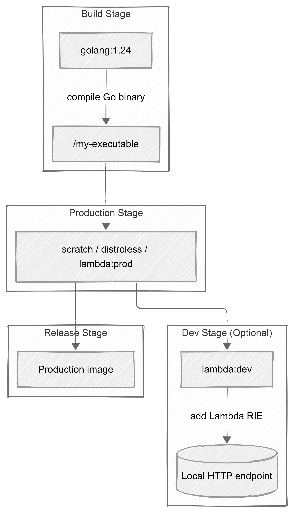

+++
title = 'Cutting container image size with multi-stage builds (Go Lambda)'
date = 2025-08-02T15:20:00+02:00
ShowToc = true
tags = ['tech', 'containers', 'go', 'tips']
+++

Multi-stage container images have been a good friend of mine for some time now.
They enable projects to package smarter by splitting the **build** and **run** phases of a given software.

## Intro to multi-stage

Let's start with a simple **hello world** program in Go.

Here is a minimal working example that will be used for our builds

```go
package main

import "fmt"

func main() {
	fmt.Println("Hello from Lambda! :)")
}
```

```Dockerfile
FROM golang:1.24 AS builder

COPY go.mod .

COPY . .

RUN go build -o /my-executable

CMD ["/my-executable"]
```

Building this image gives an astonishing **888 MB** image, thanks to all the development and build dependencies baked into `golang:1.24`.
This will be our **baseline**.

Multi-stage containers, as stated in the Docker documentation, allow us to strip away dev/build dependencies from the final image.
This reduces:

* **Image size**
* **Attack surface** (security folks love that)
* **Pull and start-up overhead**

[^1]: This is very easy to notice if you compare the pull time of a 15 GB image to a 15 MB one.

Over time, I’ve even experimented with introducing a **testing stage** in container builds, but I eventually settled into the more common pattern:
use multi-stage mainly to get **lean production images**.

Tools like `uv` now offer fine-grained, cache-enabled build workflows, making this pattern even more attractive.

---

### Simple multi-stage example

Let’s leverage [scratch images][docker-scratch] for the smallest possible image:

```Dockerfile
FROM golang:1.24 AS builder

COPY go.mod .

COPY . .

RUN go build -o /my-executable

FROM scratch AS release

COPY --from=builder /my-executable /my-executable

CMD ["/my-executable"]
```

Now the final image is only **2.21 MB**.
Hard to beat without more complex build system tricks.

**However, scratch images are often impractical in production**: no shell, no package manager, no libraries.

### Using Distroless images

A neat middle ground is provided by [Distroless images][gh-distroless]:
they’re slim, minimal images with just the runtime libraries needed to execute your program.

Here’s our Go example adapted to a distroless base:

```Dockerfile
FROM golang:1.24 AS builder

COPY go.mod .

COPY . .

RUN go build -o /my-executable

FROM gcr.io/distroless/static-debian12 AS release

COPY --from=builder /my-executable /my-executable

CMD ["/my-executable"]
```

This gives you:

* Small footprint
* Runtime libraries included
* Slightly better debugging and operational capabilities than `scratch`

Distroless images can also be **custom-built** using [Bazel rules][gh-bazel-distroless] if you need more control.

### Base Image comparison

| Build type                 | Base image                          | Approx. size | Notes                                         |
| -------------------------- | ----------------------------------- | ------------ | --------------------------------------------- |
| **Single-stage**           | `golang:1.24`                       | \~888 MB     | Includes full Go toolchain and build deps     |
| **Two-stage (scratch)**    | `scratch`                           | \~2.2 MB     | Smallest possible image, no OS libs/tools     |
| **Two-stage (distroless)** | `gcr.io/distroless/static-debian12` | \~8–10 MB    | Minimal OS libs included, better prod support |

> Sizes will vary depending on your binary and build flags.
> Scratch is the smallest but lacks any runtime conveniences, while Distroless offers a good security–functionality balance.

## Going further - AWS Lambda support

*I love AWS Lambda. I love Go. Now, I do Lambdas in Go. Quick maths.*

One thing I always want for my Lambdas is **local execution**.
My go-to solution is the **[Lambda Runtime Interface Emulator (RIE)][gh-lambda-rie]** because it’s dead simple to integrate and works with [LocalStack][gh-localstack] for a cloud-like local workflow.

Here’s a multi-stage Dockerfile for a Go-based Lambda:

```Dockerfile
FROM golang:1.24 AS build

WORKDIR /app

# Copy dependencies list
COPY go.mod go.sum ./

# Build with optional lambda.norpc tag
COPY . .
RUN go build -tags lambda.norpc -o my-lambda

# Production image
FROM public.ecr.aws/lambda/provided:al2023 AS production

COPY --from=build /app/my-lambda ./my-lambda
ENTRYPOINT [ "./my-lambda" ]

# Development image with RIE
FROM production AS dev

RUN mkdir -p /aws-lambda-rie && \
    curl -Lo /aws-lambda-rie/aws-lambda-rie https://github.com/aws/aws-lambda-runtime-interface-emulator/releases/latest/download/aws-lambda-rie && \
    chmod +x /aws-lambda-rie/aws-lambda-rie

ENTRYPOINT [ "/aws-lambda-rie/aws-lambda-rie", "./my-lambda" ]
```

And we can consider the following code for it:

```go
// main.go
package main

import (
    "context"
    "github.com/aws/aws-lambda-go/lambda"
)

func handler(ctx context.Context) (string, error) {
    return "Hello from Lambda! :)", nil
}

func main() {
    lambda.Start(handler)
}
```

This setup allows:

* A **production-ready image**
* A **dev variant** with local HTTP interface via RIE

Build commands:

```console
$ docker build -t lambda:prod --target production .
$ docker build -t lambda:dev --target dev .
$ docker build -t lambda:default .  # defaults to dev
```

I often **default to production** by ending the Dockerfile with:

```Dockerfile
FROM production AS release
```

Now, the default image is the production one:

```console
$ docker build -t lambda:default .  # now "release"
```

And you still have **local dev support** through the `dev` target.

### Local invocation example with RIE

Once you’ve built the `dev` target with RIE included:

```bash
docker build -t lambda:dev --target dev .
```

You can run it locally, binding the Lambda’s HTTP interface to a port:

```bash
docker run --rm -p 9000:8080 lambda:dev
```

Now send an event to it using `curl`:

```bash
curl -XPOST \
    "http://localhost:9000/2015-03-31/functions/function/invocations" \
    -d '{}'
```

Expected output:

```json
{"statusCode":200,"body":"Hello from Lambda! :)"}
```


## Conclusion



Multi-stage builds are one of those Docker features that feel like a cheat code:

* Lighter images
* Cleaner CI/CD pipelines
* Local dev and production parity

Combine it with tools like `distroless` or Lambda RIE, and you get both security and convenience.

Feel free to reach out if you have feedback or questions!

[Theo "Bob" Massard][linkedin]

[linkedin]: https://linkedin.com/in/tbobm/
[docker-scratch]: https://hub.docker.com/_/scratch
[gh-distroless]: https://github.com/GoogleContainerTools/distroless
[gh-lambda-rie]: https://github.com/aws/aws-lambda-runtime-interface-emulator
[gh-localstack]: https://github.com/localstack/localstack
[gh-bazel-distroless]: https://github.com/GoogleContainerTools/rules_distroless/tree/main
