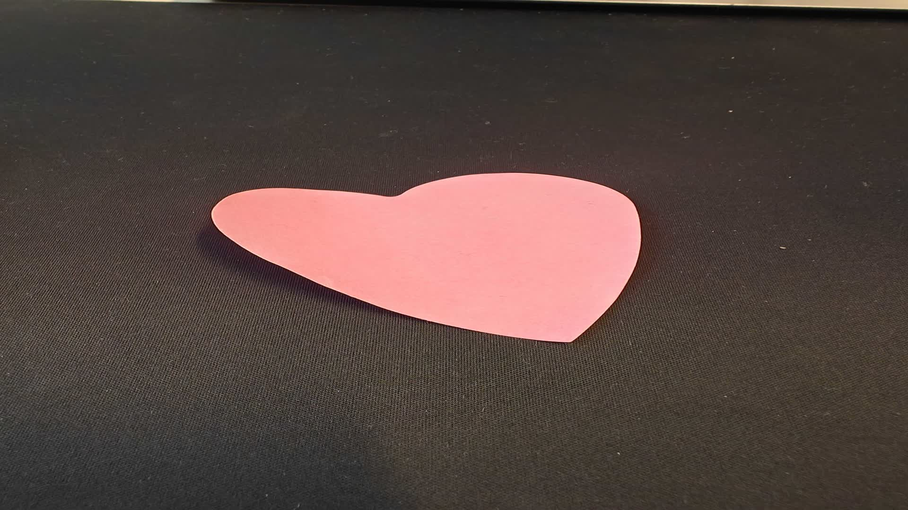

+++
title = 'Watermarking pictures using Pillow and Libvips'
date = 2024-11-13T13:35:00+02:00
ShowToc = true
tags = ['media processing', 'performance', 'python', 'go', 'tech']
+++

Working in the Media Processing industry, I very often encounter 2 concept: **adding overlay to images** and **doing it fast**.

As I'm very much interested in tackling this problem well enough and using proper tooling for performance effiency, I explored several options that allows watermarking pictures.

> Code is available at [github.com/tbobm/watermarking-images-for-fun-and-profit][gh-repo]

[gh-repo]: https://github.com/tbobm/watermarking-images-for-fun-and-profit

## Watermarking pictures

To put things back context, watermarking is the act of applying an **overlay** to a **media**.
This can be performed through many different operation and is used to apply branding, explicit ownership, or to *scope usage to a specific audience* [^1].

[^1]: France developped government [filigrane.beta.gouv.fr][filigrane], which can be used to mitigate fraud and scams

Watermarking can be applied to many different type of data but we'll narrow down to **images** and 
more specifically, PNG overlays on JPG.

[filigrane]: https://filigrane.beta.gouv.fr/

The main goal is to be able to just "apply" our overlay to the base image. I've been dealing this
with setup in Python for a while and always ended up using [Pillow][pillow] but [libvips][libvips] has also
been around for quite a while and peaked my interest a couple months ago.

Time went on and I finally drafted a short minimal working setup to compare those two libraries.

## Initial test scenario

We will be using a simple JPEG file (1920x1080) as the base image and a small PNG overlay to explore
the different implementations.




### Python + Pillow

My historical go-to library for interacting with images has always been "Good Old Pil[low]"
which has been around for quite some time now.

The API is quite straight-forward and we can rely on [`Image.paste`][pillow-paste] to apply the overlay
to the source Image.

[pillow-paste]: https://pillow.readthedocs.io/en/stable/reference/Image.html#PIL.Image.Image.paste

```python3
source = Image.open(SOURCE_IMAGE)
overlay = Image.open(OVERLAY_IMAGE)

position_x, position_y = (source.width - overlay.width) // 2, (source.height - overlay.height) // 2
# watermarking operation
source.paste(overlay, (position_x, position_y), overlay)
source.save(RESULT_IMAGE)
```

Let's see how this snippet behaves when run using [`hyperfine`] [hyperfine-gh]:

```console
$ hyperfine 'poetry run python3 example_pillow/main.py'
Benchmark 1: poetry run python3 example_pillow/main.py
  Time (mean ± σ):      1.100 s ±  0.036 s    [User: 2.540 s, System: 0.079 s]
  Range (min … max):    1.044 s …  1.160 s    10 runs
```

Roughly **1.1s** for the whole command execution, not bad.
Let's keep this number in mind for later.

### Python + Libvips

Another candidate that I've been looking at for quite a while has been [libvips][libvips-home],
_a demand-driven, horizontally threaded image processing library_. The [benchmarks][vips-bench] listed
in their documentation are really interesting and I was eager to experiment with it.

Knowing that it has Python bindings, we can duplicate and adapt our initial Pillow script
to use [PyVips][pyvips-gh].

The watermarking operation is performed using a [pyvips.Image.composite2][pyvips-composite2] operation.

```python
source = pyvips.Image.new_from_file(SOURCE_IMAGE)
overlay = pyvips.Image.new_from_file(OVERLAY_IMAGE)

position_x, position_y = (source.width - overlay.width) // 2, (source.height - overlay.height) // 2

# watermarking operation performed using composite2
watermarked = source.composite2(overlay, "over", x=position_x, y=position_y)
watermarked.write_to_file(RESULT_IMAGE)
```

We can now run our performance evaluation command:

```console
$ hyperfine 'poetry run python3 example_pyvips/main.py'
Benchmark 1: poetry run python3 example_pyvips/main.py
  Time (mean ± σ):      1.330 s ±  0.044 s    [User: 2.792 s, System: 0.141 s]
  Range (min … max):    1.277 s …  1.425 s    10 runs
```

_1.33s ? Odd._ Expecting the library to be blazing fast, let's keep this number in mind too.
Everything will make sense in a very short moment.

### Dive in the results

By looking at **script execution** instead of **operation duration**, we also have unrelated processing
taking up some part of the duration. We have, for instance:
- Python interpreter startup time
- I/O operations
- Module import duration

Something that we often don't see, especially when working on relatively small projects, is the potential
impact of the whole execution performed under-the-hood of some modules we used. Some projects, when imported,
will perform a set of actions such as bootstrapping dependencies, logging, ...

A few years ago the Instagram Engineering team wrote about the
concept of [Strict Modules][ig-blog-strict] that would guarantee the **absence of side effects**.
The concept in itself is great and can offer a lot of improvements, both for development and production
workloads.

By checking the duration of both import statements, we can already have a hint:
- `import pillow`: **00.069217s**
- `import pyvips`: **00.172800s**

Naturally, I ended up diving a bit in both project's (Pillow and PyVips) entrypoints and 
without any surprise, we can observe that PyVips' entrypoint
([`__init__.py`][pyvips-init]) is loading the LibVips bindings, configuring logging, ... which can add up.

Considering that those values are not relevant for an actual long lived service
(i.e.: ECS Service) or an execution with a Warmed up environment (i.e.: Lambdas), we
can safely dismiss those durations that correspond to "cold starts".

If instead of observing the end to end processing, we only observe the actual
**watermarking operation** by extracting this specific code snippet
from our example code, we can have a much more accurate representation of a
realistic calculation.

We can achieve this by fiddling around with the `functools.partial` method
and the `timeit` module.

Our Pillow function now looks like the following:
```python
import timeit
to_test = functools.partial(source.paste, overlay, (position_x, position_y), overlay)
res = timeit.timeit(to_test, number=100000)
print(res)
```

And the PyVips function:
```python
import timeit
to_test = functools.partial(source.composite2, overlay, "over", x=position_x, y=position_y)
res = timeit.timeit(to_test, number=100000)
print(res)
```

We end up with the following summary table:

| Library | 100 000 watermarks | Import module | Single run duration |
|---------|--------------------|---------------|--------------|
| Pillow  |             73.80s |    00.046741s |        1.10s |
| PyVips  |              8.09s |    00.174187s |        1.33s |

As we can see, the tiny overhead that we initially observed
with the single end to end script run timing is more than justified
on PyVips' end.
By being nearly x10 faster to perform the same number operation, it's easy to
visualize the performance gains from using PyVips.

However, as stated in their ["Notes"][pyvips-benchmark-notes] section,
LibVips is by default shining on multi-core systems, which is what I'm using.

### Bonus: Golang + Libvips

As a bonus and for the sake of trying it out, I put together a simple
Golang-based implementation. No surprise here, the whole program is going
faster than both end to end Python implementation and the language overhead
is slimmer than when using PyVips.

```console
$ go build
$ hyperfine  watermark-vips
Benchmark 1: watermark-vips
  Time (mean ± σ):     292.2 ms ±  24.3 ms    [User: 281.3 ms, System: 72.1 ms]
  Range (min … max):   252.6 ms … 321.3 ms    10 runs
```

Of course, this has much more implications as it's a whole different language, but it's
still great to know how much of a difference switching to Go could make in a specialized
micro-service approach.

## Observations

It was quite fun to take the time to try out different patterns and to highlight the performances differents (here, speed mostly) of both libraries I've been using for a while.

There is no right or wrong regarding Library choice as Pillow still has plenty of usages, especially due to how easy it is to include in a project due to its "completeness" whereas PyVips' plugin mechanism can sometimes include a "compile it yourself" step to support different file types.


[hyperfine-gh]: https://github.com/sharkdp/hyperfine
[libvips-home]: https://www.libvips.org/
[vips-bench]: https://github.com/libvips/libvips/wiki/Speed-and-memory-use
[pyvips-gh]: https://github.com/libvips/pyvips
[pyvips-composite2]: https://libvips.github.io/pyvips/vimage.html?highlight=composite#pyvips.Image.composite2
[ig-blog-strict]: https://instagram-engineering.com/python-at-scale-strict-modules-c0bb9245c834
[pyvips-init]: https://github.com/libvips/pyvips/blob/master/pyvips/__init__.py
[pyvips-benchmark-notes]: https://github.com/libvips/libvips/wiki/Speed-and-memory-use#notes
